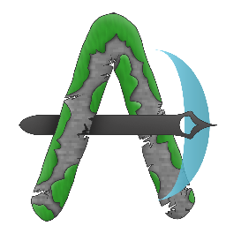

<div id="top"></div>

<br />
<div align="center">
  <a href="https://github.com/Maxime-lbc/Alcanderia-front-end">
    
  </a>

  <h3 align="center">Alcanderia front end</h3>

  <p align="center">
    Alcanderia is a modded Minecraft server. This project is the main website built on ReactJS    <br />

<br /></div>

<!-- TABLE OF CONTENTS -->
<details>
  <summary>Table of Contents</summary>
  <ol>
    <li>
      <a href="#about-the-project">About The Project</a>
      <ul>
        <li><a href="#built-with">Built With</a></li>
      </ul>
    </li>
    <li>
      <a href="#getting-started">Getting Started</a>
      <ul>
        <li><a href="#prerequisites">Prerequisites</a></li>
        <li><a href="#installation">Installation</a></li>
      </ul>
    </li>
    <li><a href="#usage">Usage</a></li>
    <li><a href="#roadmap">Roadmap</a></li>
    <li><a href="#contributing">Contributing</a></li>
    <li><a href="#license">License</a></li>
    <li><a href="#contact">Contact</a></li>
    <li><a href="#acknowledgments">Acknowledgments</a></li>
  </ol>
</details>

<!-- ABOUT THE PROJECT -->

## About The Project

Alcanderia is a modded Minecraft server. This project is the main website built on ReactJS.

<p align="right">(<a href="#top">back to top</a>)</p>

### Built With

This web site is built on:

- [TypeScript](https://www.typescriptlang.org/)
- [React.js](https://reactjs.org/)
- [TailwindCSS](https://tailwindcss.com/)
- [Redux](https://redux.js.org/)
- [ReactUse](https://github.com/streamich/react-use)
- [I18Next](https://www.i18next.com/)

<p align="right">(<a href="#top">back to top</a>)</p>

<!-- GETTING STARTED -->

## Getting Started

### Prerequisites

You must have NodeJS and npm installed on your machine.

### Installation

1. Clone the repo
   ```sh
   git clone https://github.com/Maxime-lbc/Alcanderia-front-end
   ```
2. Install NPM packages
   ```sh
   yarn | npm install
   ```

<p align="right">(<a href="#top">back to top</a>)</p>

<!-- USAGE EXAMPLES -->

## Usage

### `yarn start`

Runs the app in the development mode.\
Open [http://localhost:8080](http://localhost:3000) to view it in the browser.

The page will reload if you make edits.\
You will also see any lint errors in the console.

### `yarn build`

Builds the app for production to the `build` folder.\
It correctly bundles React in production mode and optimizes the build for the best performance.

The build is minified and the filenames include the hashes.\
Your app is ready to be deployed!

<p align="right">(<a href="#top">back to top</a>)</p>


## Commits prefered syntaxe

_When you commit changes this syntax is prefered. It makes the history looking better_

| Case             | Message            |
| ---------------- | ------------------ |
| Add Feature      | ✨ Add Feature     |
| Fix Bug          | 🐞 Fix Bug         |
| Refactoring Code | 🛠 Refactoring Code |
| Install Package  | 📦 Install Package |
| Fix Readme       | 📚 Fix Readme      |
| Update Version   | 🌼 Update Version  |
| New Template     | 🎉 New Template    |

<!-- LICENSE -->


## License

Distributed under the MIT License. See `LICENSE.txt` for more information.

<p align="right">(<a href="#top">back to top</a>)</p>

<!-- CONTACT -->

## Contact

Project Link: [https://github.com/Maxime-lbc/Alcanderia-front-end](https://github.com/Maxime-lbc/Alcanderia-front-end)

<p align="right">(<a href="#top">back to top</a>)</p>
